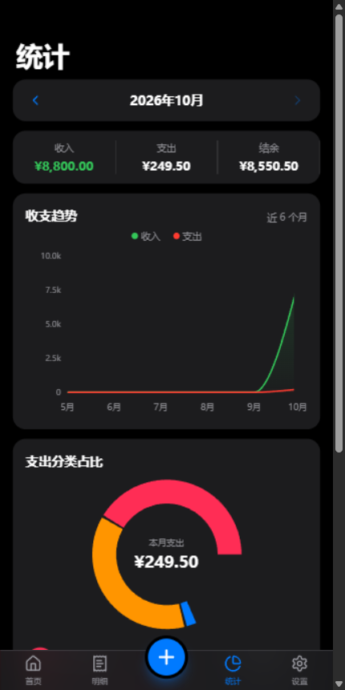
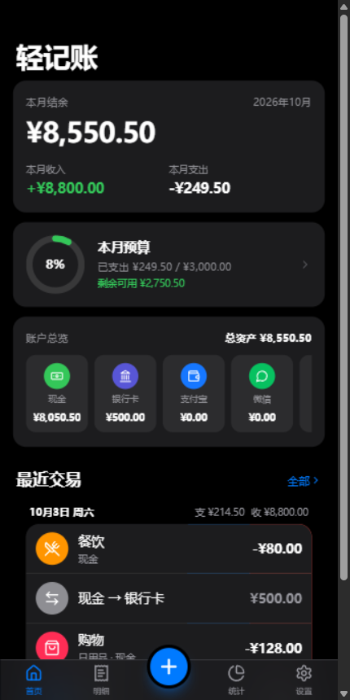

# 轻记账 · Qing Ledger

<p align="center">
  
</p>

一款简洁优雅的 **iOS 风格移动端记账 PWA**。纯前端实现、零后端、零付费 API，数据完全保存在本机浏览器（localStorage），支持 **离线使用** 与 **添加到 iOS / Android 主屏幕**，体验接近原生 App。可一键部署到 GitHub Pages。

| 首页（浅色） | 记一笔 | 明细 | 统计（深色） | 首页（深色） |
| --- | --- | --- | --- | --- |
|  |  |  |  |  |

## ✨ 功能

### 首页
- 本月收入 / 支出 / 结余概览
- 预算进度环（超支变红）与剩余可用
- 账户总览横滑卡片（各账户实时余额 + 总资产）
- 最近交易列表，底部悬浮 **「+」** 快速记一笔

### 记一笔
- **支出 / 收入 / 转账** 三种模式（分段控件切换）
- iOS 计算器风格数字键盘：支持 **加减运算、小数点、删除**
- 分类九宫格：餐饮、交通、购物、居住、娱乐、医疗、教育、通讯 / 工资、奖金、投资、兼职等
- 账户选择：现金、银行卡、支付宝、微信、信用卡（可自定义增删）
- 日期（原生日期选择）、备注、标签
- 保存后自动更新账户余额与统计，触发预算超支时弹出 **橙色预警 Toast**

### 明细
- 按日分组，组头显示当日收支小计
- 关键词搜索（备注 / 标签 / 分类 / 账户）
- 多维筛选：类型、分类（多选）、账户（多选）、金额范围、日期区间
- **左滑编辑 / 删除**，删除后 Toast **一键撤销**
- **长按进入多选模式**，支持全选与批量删除（带确认弹窗）

### 统计
- 月度收支趋势（近 6 个月面积图）
- 支出分类占比环形图（中心显示总支出）
- 分类排行榜（图标 + 占比进度条）
- 月度对比：收入 / 支出增减 + Top 5 分类环比

### 预算
- 月度总预算：环形进度、剩余可用、日均可用
- 分类预算：进度条、接近超支橙色预警、超支红色提示
- 数字键盘快速设置 / 调整 / 清除预算

### 账户
- 账户列表与实时余额、净资产合计
- 新增 / 编辑 / 删除账户（删除会级联删除相关交易，需确认）
- 转账入口（转出 / 转入不能为同一账户）

### 设置
- 外观：浅色 / 深色 / 跟随系统
- 货币单位（¥ $ € £ ￥）
- 数据导出 JSON 备份 / CSV 明细（带 BOM，Excel 中文不乱码）
- 导入 JSON 备份（整体覆盖，需确认）
- 清空全部数据（危险操作二次确认）
- 关于页

### PWA
- `vite-plugin-pwa` 预缓存全部静态资源，**离线可完整使用**
- 自动 Service Worker 更新
- Manifest：应用名、主题色 #007AFF、图标（192 / 512 / maskable）
- `apple-touch-icon`、`viewport-fit=cover`、`safe-area-inset` 全面屏适配
- iOS「添加到主屏幕」后全屏独立运行

## 🛠 技术栈

React 18 · TypeScript · Vite · Tailwind CSS · Zustand（persist 持久化）· React Router（HashRouter）· Recharts · Framer Motion · date-fns · lucide-react · vite-plugin-pwa

## 🚀 本地运行

```bash
npm install
npm run dev        # 开发：http://localhost:5173
npm run build      # 类型检查 + 生产构建（输出 dist/）
npm run preview    # 本地预览生产构建：http://localhost:4173
npm run icons      # 重新生成 PWA 图标（仅修改 icons 时需要）
```

> 要求 Node.js ≥ 18。项目无任何环境变量与后端依赖。

## 📦 部署到 GitHub Pages

项目已内置 GitHub Actions 自动部署（`.github/workflows/deploy.yml`），构建使用相对路径 `base: './'` + HashRouter，**无需修改任何配置**，放在仓库子路径也不会 404：

1. 在 GitHub 新建仓库，例如 `qing-ledger`
2. 推送代码：

```bash
cd qing-ledger
git init
git add .
git commit -m "feat: 轻记账 v1.0.0"
git branch -M main
git remote add origin https://github.com/<你的用户名>/qing-ledger.git
git push -u origin main
```

3. 仓库 **Settings → Pages → Build and deployment → Source** 选择 **GitHub Actions**
4. 等待 Actions 运行完成，访问 `https://<你的用户名>.github.io/qing-ledger/`
5. 手机浏览器打开 → 分享 → **添加到主屏幕**，即可像原生 App 一样使用

> 每次推送 `main` 分支都会自动重新构建部署；也可在 Actions 页面手动触发（workflow_dispatch）。

## 📁 目录结构

```
qing-ledger/
├── .github/workflows/deploy.yml   # GitHub Pages 自动部署
├── scripts/generate-icons.mjs     # PWA 图标生成脚本（pngjs 程序化绘制）
├── public/
│   ├── favicon.svg
│   └── icons/                     # 生成的 PWA 图标（192/512/maskable/apple-touch）
├── src/
│   ├── main.tsx                   # 入口：HashRouter + SW 注册
│   ├── App.tsx                    # 路由、页面切换动画、全局面板
│   ├── index.css                  # Tailwind 与全局样式、安全区工具类
│   ├── types/index.ts             # 全局数据模型
│   ├── constants/
│   │   ├── categories.ts          # 预置分类 / 账户 / 货币
│   │   └── icons.tsx              # 图标 key -> lucide 组件映射
│   ├── utils/
│   │   ├── format.ts              # 金额格式化 + 数字键盘表达式求值
│   │   ├── balance.ts             # 账户余额实时推导
│   │   ├── tx.ts                  # 分组 / 月度统计 / 筛选
│   │   ├── budget.ts              # 预算状态与超支预警
│   │   ├── backup.ts              # JSON / CSV 导入导出
│   │   └── id.ts                  # 短 ID 生成
│   ├── store/
│   │   ├── useStore.ts            # 核心数据（persist 到 localStorage）
│   │   └── useUIStore.ts          # 会话级 UI 状态（弹窗 / Toast）
│   ├── hooks/                     # useTheme / useIsDark / useLongPress
│   ├── components/
│   │   ├── layout/                # Page（毛玻璃导航 + 大标题）、TabBar（含悬浮 +）
│   │   ├── ui/                    # Sheet / Toast / Confirm / Segmented / SwipeableRow /
│   │   │                          # ProgressRing / ProgressBar / EmptyState / Switch
│   │   └── tx/                    # AddTransactionSheet / Numpad / CategoryGrid /
│   │                              # TransactionRow / TransactionList / FilterSheet /
│   │                              # AccountSelectSheet / AmountSheet
│   └── pages/                     # Home / Transactions / Stats / Budget / Accounts / Settings / About
├── index.html                     # PWA meta、safe-area、主题色
├── vite.config.ts                 # base './' + vite-plugin-pwa
├── tailwind.config.ts             # iOS 设计系统色板 / 圆角
└── package.json
```

## 🎨 设计规范

- 字体：`-apple-system, BlinkMacSystemFont, "SF Pro Text", "SF Pro Display", Inter, sans-serif`
- 主色 `#007AFF` · 成功 `#34C759` · 危险 `#FF3B30` · 警告 `#FF9500`
- 浅色：背景 `#F2F2F7` / 卡片 `#FFFFFF`；深色：背景 `#000000` / 卡片 `#1C1C1E`
- 分割线 `rgba(60,60,67,0.29)`（深色 `rgba(84,84,88,0.65)`）
- 圆角：卡片 16px · 按钮 12px · 弹窗 22px
- 导航栏 44px 毛玻璃 + 大标题随滚动收缩；Tab Bar 49px + 底部安全区
- 最大宽度 430px，桌面端居中模拟手机预览
- Spring 动画、按钮按压缩放、触控区域 ≥ 44px

## 💡 实现说明

- **余额不落库**：账户余额由 `初始余额 + 全部流水` 实时推导（`utils/balance.ts`），增删改交易永不失同步
- **弹窗不依赖 AnimatePresence**：底部弹窗 / 确认框 / Toast 采用「延迟卸载」确定性方案，避免退场动画不解析导致透明遮罩挡住页面
- **导出 CSV 带 BOM**：Excel 直接打开中文不乱码
- **数字键盘表达式**：支持 `12.5+3-1` 形式，保存时求值，两位小数封顶

## 📄 License

[MIT](LICENSE)
